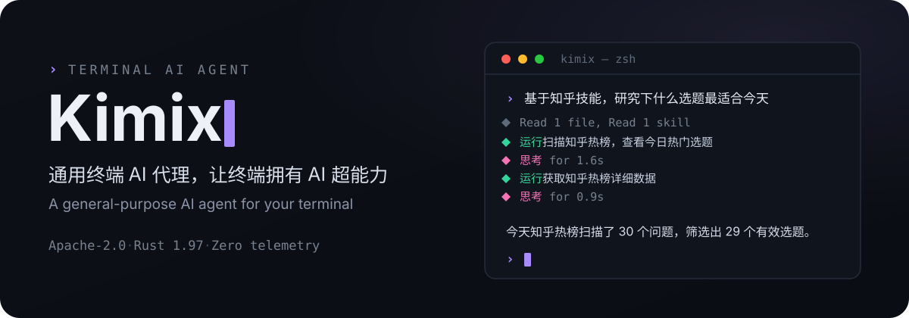
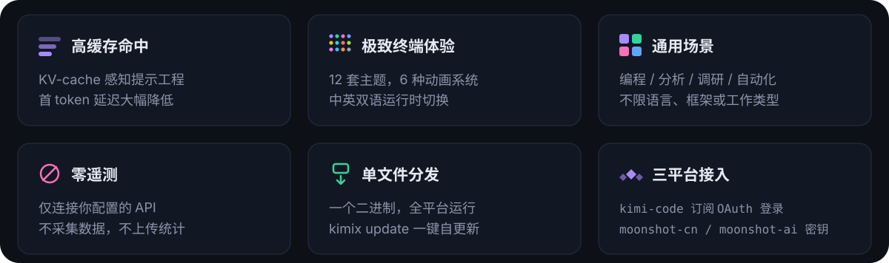
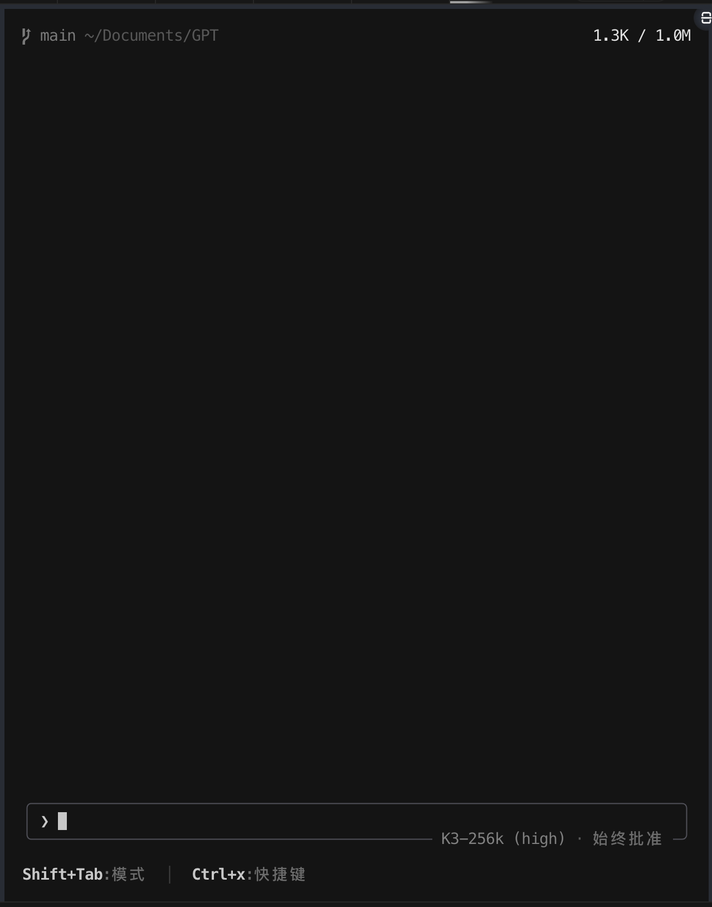
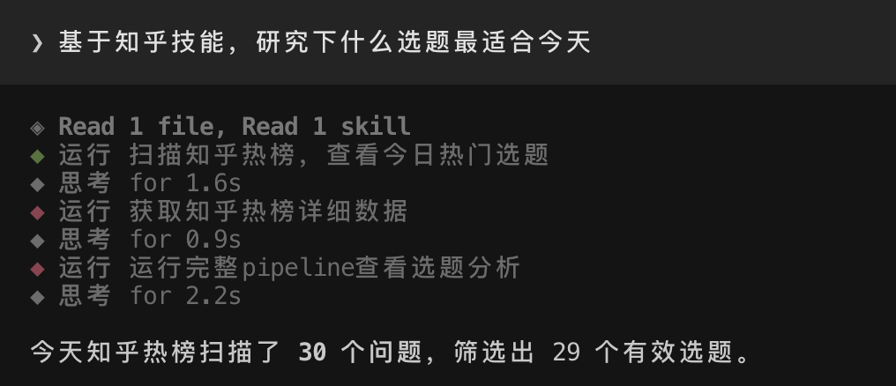
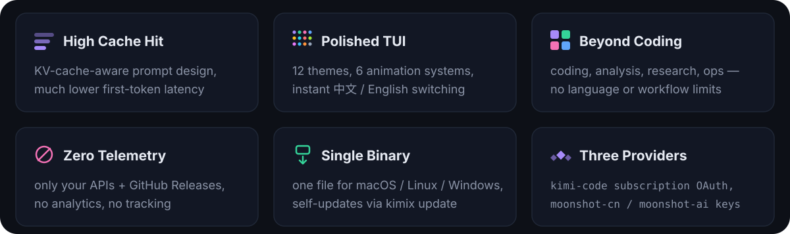

<p align="center">
  
</p>

<div align="center">

[](LICENSE)
[](rust-toolchain.toml)
[](#快速开始)

**[中文](#中文) · [English](#english)**

</div>

---

## 中文

### 什么是 Kimix？

Kimix 是一个通用的终端 AI 代理工具，基于 [xai-org/grok-build](https://github.com/xai-org/grok-build)（Apache-2.0）的 hard fork，
支持 Kimi Code 订阅 API 等平台。

它以全屏 TUI 的方式运行，能理解你的工作目录、编辑文件、执行命令、搜索网络，
管理长时运行任务。既可以交互使用，也可以在脚本 / CI 中无头运行，
还支持通过 ACP 协议嵌入编辑器。

kimix 采用 Grok 4.5、Kimi K3 两个优秀模型构建，并在真实环境中使用 DeepSeek、Mimo、LongCat-2.0
等开源模型做了广泛测试——已经实现通过 kimix 来更新迭代 kimix 自身。

适用场景：
- 💻 编程辅助：理解代码库、重构、修 bug、写测试
- 📊 数据分析：读取文件、运行脚本、生成报告
- 🔍 调研搜索：联网检索、信息收集、趋势分析
- ⚙️ 自动化：多步工作流编排、批量处理、定时任务

### 为什么选 Kimix？

<p align="center">
  
</p>

<table align="center">
  <tr>
    <td width="46%" align="center">
      
      <br><sub>启动即见模型状态与命令面板</sub>
    </td>
    <td width="54%" align="center" valign="top">
      
      <br><sub>真实任务 trace：工具调用与思考过程全程可见</sub>
    </td>
  </tr>
</table>


### 快速开始

```sh
# 安装（macOS / Linux）
curl -fsSL https://raw.githubusercontent.com/taxueseek/kimix/main/install.sh | bash
```

```powershell
# Windows PowerShell
irm https://raw.githubusercontent.com/taxueseek/kimix/main/install.ps1 | iex
```

```sh
kimix --version   # kimix 0.1.14 … unofficial Kimi Code CLI community build
kimix login       # Kimi Code 订阅登录（设备码 OAuth 流程）
kimix             # 启动全屏 TUI
kimix -p "你好"    # 无头模式，直接提问
```

安装器会校验 SHA256SUMS，将二进制安装到 `~/.kimix/bin/kimix`
（Windows: `%USERPROFILE%\.kimix\bin\kimix.exe`）。
后续版本通过内置自更新器获取（`kimix update`，由 `KIMIX_AUTO_UPDATE` 控制）。

### 供应商与 API 密钥

Kimix 连接固定的三平台注册表：

| 平台标识      | 基础 URL                         | 认证方式                          |
| ------------- | -------------------------------- | --------------------------------- |
| `kimi-code`   | `https://api.kimi.com/coding/v1` | Kimi Code 订阅 OAuth（`kimix login`） |
| `moonshot-cn` | `https://api.moonshot.cn/v1`     | Moonshot 开放平台 API Key         |
| `moonshot-ai` | `https://api.moonshot.ai/v1`     | Moonshot 开放平台 API Key         |

Moonshot API Key 通过环境变量或 `~/.kimix/config.toml` 配置（环境变量优先，值不记录日志）：

```sh
export KIMIX_MOONSHOT_API_KEY=sk-...     # 通用环境变量
export KIMIX_MOONSHOT_CN_API_KEY=sk-...  # 平台专属，比通用名优先
export KIMIX_MOONSHOT_AI_API_KEY=sk-...
```

```toml
# ~/.kimix/config.toml
[platforms.moonshot-cn]
api_key = "sk-..."

[platforms.moonshot-ai]
api_key = "sk-..."
```

登录和启动时，Kimix 从各平台同步模型列表（`GET {base}/models`），
并在模型选择器中展示合并后的目录（键为 `{平台标识}/{模型ID}`）。
如果同步失败，使用上次缓存的目录；无缓存时回退到内置基础列表。

网络搜索 / 获取功能运行在 Kimi Code 订阅服务上，
仅在 OAuth 会话中可用，与官方客户端一致。

### 从源码构建

```sh
rustup toolchain install 1.97.0
cargo build --profile release-dist -p kimix-bin
./target/release-dist/kimix --version
```

`protoc` 通过 vendored [dotslash](https://dotslash-cli.com) 启动器调用（`bin/protoc`）；
如果 PATH 上无 dotslash，先安装：`brew install dotslash` 或 `cargo install dotslash`。

### 与官方 Kimi CLI 共存

Kimix 与 Moonshot AI 和 xAI 无任何关联。它与官方 `kimi` CLI 可同时安装：
独立二进制名、独立配置目录（`~/.kimix`）、独立密钥环凭证（服务名 `kimix`）、
独立的 `KIMIX_*` 环境变量命名空间。不会读取或写入官方客户端安装的任何内容。

首次启动时，Kimix 提供**一次性、严格只读**的 `kimix import-kimi` 命令，
可导入已有 `~/.kimi` 的配置（MCP 服务器、自定义供应商、默认模型），
`~/.kimi` 下的文件内容和修改时间不受影响，有完整测试覆盖。

### 许可证

Apache-2.0。详见 [LICENSE](LICENSE)、[NOTICE](NOTICE) 和
[THIRD-PARTY-NOTICES](THIRD-PARTY-NOTICES.md)。来自 openai/codex 和 sst/opencode
的移植代码记录在 [crates/codegen/kimix-tools/THIRD_PARTY_NOTICES.md](crates/codegen/kimix-tools/THIRD_PARTY_NOTICES.md)。
Kimix 基于 Grok Build 开源代码构建，`--version` 输出携带相关归属声明。

---

## English

### What is Kimix?

Kimix is a general-purpose terminal AI agent — a hard fork of
[xai-org/grok-build](https://github.com/xai-org/grok-build) (Apache-2.0),
re-targeted at the Kimi Code subscription API and the Moonshot open platform.

It runs as a full-screen TUI that understands your working directory,
edits files, executes shell commands, searches the web, and manages
long-running tasks. Use it interactively, headlessly for scripting/CI,
or embedded in editors via the Agent Client Protocol (ACP).

kimix itself is built with Grok 4.5 and Kimi K3, and battle-tested against
open models such as DeepSeek, Mimo, and LongCat-2.0 — kimix is already
used to iterate on kimix.

Use cases:
- 💻 Coding assistance: understand codebases, refactor, fix bugs, write tests
- 📊 Data analysis: read files, run scripts, generate reports
- 🔍 Research: web search, information gathering, trend analysis
- ⚙️ Automation: multi-step workflow orchestration, batch processing, scheduled tasks

### Why Kimix?

<p align="center">
  
</p>

<table align="center">
  <tr>
    <td width="46%" align="center">
      
      <br><sub>Model status and command palette at launch</sub>
    </td>
    <td width="54%" align="center" valign="top">
      
      <br><sub>Real task trace — every tool call and thinking step is visible</sub>
    </td>
  </tr>
</table>

### Quick Start

```sh
# Install (macOS / Linux)
curl -fsSL https://raw.githubusercontent.com/taxueseek/kimix/main/install.sh | bash
```

```powershell
# Windows PowerShell
irm https://raw.githubusercontent.com/taxueseek/kimix/main/install.ps1 | iex
```

```sh
kimix --version   # kimix 0.1.14 … unofficial Kimi Code CLI community build
kimix login       # sign in with your Kimi Code subscription (device-code OAuth)
kimix             # start the TUI
kimix -p "Hello"  # headless mode
```

The installer verifies every download against the release's `SHA256SUMS`,
installs into `~/.kimix/bin/kimix` (`%USERPROFILE%\.kimix\bin\kimix.exe` on
Windows), and prints the PATH line to add. Later releases arrive through the
built-in self-updater (`kimix update`, gated by `KIMIX_AUTO_UPDATE`).

### Providers and API Keys

Kimix talks to a fixed three-platform registry:

| Platform id   | Base URL                         | Auth                                      |
| ------------- | -------------------------------- | ----------------------------------------- |
| `kimi-code`   | `https://api.kimi.com/coding/v1` | Kimi Code subscription OAuth (`kimix login`) |
| `moonshot-cn` | `https://api.moonshot.cn/v1`     | Moonshot open-platform API key            |
| `moonshot-ai` | `https://api.moonshot.ai/v1`     | Moonshot open-platform API key            |

Moonshot API keys come from the environment or `~/.kimix/config.toml`
(environment wins; values are never logged):

```sh
export KIMIX_MOONSHOT_API_KEY=sk-...     # applies to both open platforms
export KIMIX_MOONSHOT_CN_API_KEY=sk-...  # platform-scoped, beats the generic name
export KIMIX_MOONSHOT_AI_API_KEY=sk-...
```

```toml
# ~/.kimix/config.toml
[platforms.moonshot-cn]
api_key = "sk-..."

[platforms.moonshot-ai]
api_key = "sk-..."
```

On login and startup Kimix syncs each configured platform's model list
from `GET {base}/models` and shows the merged catalog in the model picker
(catalog keys are `{platform_id}/{model_id}`). If the sync fails, the last
cached catalog is used; with no cache, a small built-in fallback list applies.

The web `search`/`fetch` tools ride the Kimi Code subscription services and
are present only on OAuth sessions — API-key-only sessions run without
them, matching the official client.

### Building from Source

```sh
rustup toolchain install 1.97.0
cargo build --profile release-dist -p kimix-bin
./target/release-dist/kimix --version
```

`protoc` is invoked through the vendored [dotslash](https://dotslash-cli.com)
launcher at `bin/protoc`; install dotslash (`brew install dotslash` or
`cargo install dotslash`) if it is not already on your PATH.

### Coexistence with the Official Kimi CLI

Kimix is not affiliated with Moonshot AI or xAI, and it coexists with the
official `kimi` CLI on the same machine: independent binary name,
independent config directory (`~/.kimix`), independent keyring credentials
(service `kimix`), and a `KIMIX_*` environment-variable namespace. Nothing
the official client installs or stores is ever read at runtime or written.
On first launch Kimix offers a **one-time, strictly read-only** import of
your existing `~/.kimi` configuration (MCP servers, custom providers,
default model) via `kimix import-kimi` — file contents and mtimes under
`~/.kimi` are left untouched, verified by tests.

### License

Apache-2.0. See [LICENSE](LICENSE), [NOTICE](NOTICE), and
[THIRD-PARTY-NOTICES](THIRD-PARTY-NOTICES.md). Code ported from
openai/codex and sst/opencode is documented in
[crates/codegen/kimix-tools/THIRD_PARTY_NOTICES.md](crates/codegen/kimix-tools/THIRD_PARTY_NOTICES.md).
Kimix is based on Grok Build Open Source; the `--version` output carries the
attribution.
